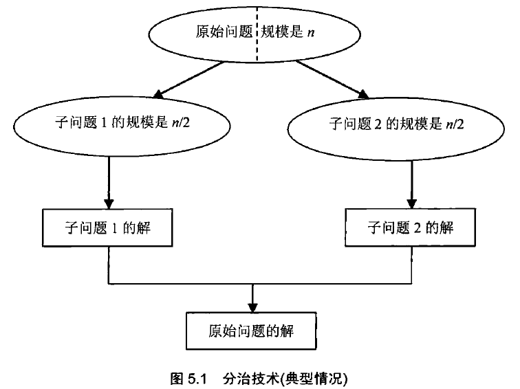
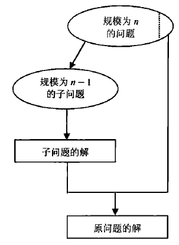
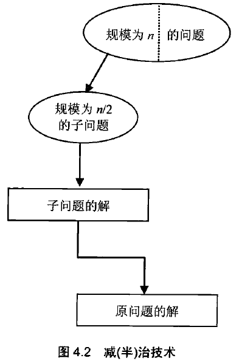
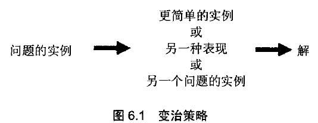

# 算法设计思想

## 蛮力

一种简单直接地解决问题的方法，直接基于问题的描述和涉及的概念定义

- 唯一一个能够应用于所有问题的策略
- 肯定会给出一种对应的解，不受数据规模的限制
- 可能比设计一个好的算法需要更少的时间
- 给出一个问题解的时间复杂度上界，衡量其它算法的时间效率

体现蛮力法的一些解决问题的方案

- 搜索所有解空间
  - 找约束条件、找枚举范围：在搜索前尽可能减小搜索空间
- 搜索所有路径
- 直接计算
- 模拟和仿真

举例：选择排序、冒泡排序、交替放置的碟子

## 分治

- 将一个问题划分为同一类型的若干子问题，子问题最好规模相同
- 对这些子问题求解（一般采用递归方法）
- 有必要的话，合并这些子问题的解，以得到原始问题的答案



能够使用分治策略的问题一般具有如下特质：

- 问题规模缩小到一定程度就很容易解决
- 问题能够划分为多个相互独立的子问题

举例：归并排序、快速排序、螺丝螺母问题、棋盘覆盖、折半查找

### 主定理

时空复杂度计算

顺序算法：
- T<sub>s</sub>(n)= a * T<sub>s</sub>(n/b)+ f(n)
- 分解为b份，其中a份需要求解，f(n)表示合并需要的时间
- 

例如，计算a<sub>0</sub>+a<sub>1</sub>+…+a<sub>n-1</sub>=(a<sub>0</sub>+…+a<sub>⎿n/2⏌-1</sub> )+(a<sub>⎿n/2⏌</sub>+…+a<sub>n-1</sub> )需要的加法次数

> A(n) = 2A(n/2) + 1，a=2, b=2, d=0
>
> =>   a > b<sup>d</sup>
>
> =>   A(n) ∈Θ(n<sup>log<sub>b</sub> a</sup>) =Θ(n)

## 减治

利用一个问题给定实例的解和同样问题较小实例的解之间的某种关系，将一个大规模的问题逐步化简为一个小规模的问题

关键是：建立与小规模问题之间的联系=>本质上是一种递推关系

有3种主要的缩小问题规模的方式

- 减去一个常量，通常是1
  - 

- 减去一个常量因子，通常为2
  - 

- 减去一个可变的规模
  - e.g. 欧几里得算法求最大公因数、Shell排序

举例：插入排序（减一法）、Shell排序

### 减治法 vs 分治法

- 分治：是多个小问题，小问题之间的联系
- 减治：还是一个小问题，小问题与原问题之间的联系

## 变治

通过转换问题使得原问题更容易求解



- 实例化简
  - 还是原来的问题，只是进行了一些中间操作，使得问题求解变得容易
  - 举例：预排序
  
- 改变表现
  - 主要是改变使用的数据结构
  - 举例：平衡查找树、堆
  
- 问题化简
  - 将给定的问题变换为一个新的问题，对新的问题求解
  - 举例：对NP难问题和NP完全问题的定义

## 时空权衡

空间换时间

算法设计中的表述

- 输入增强
  - 对问题的部分或全部输入做预处理，然后对获得的额外信息进行存储，以加速后面问题的求解
  - 举例：计数排序、Boyer-Moore字符串匹配

- 简单的使用额外的空间实现更快、更方便的数据存储——“预构造”
  - 只涉及存储结构
  - 举例：散列法Hash——HashMap等、B树索引
  
- 动态规划
  - 减治法找到递推关系；记录上一次求解结果

举例：计数排序

### 动态规划

- 一种“使多阶段决策过程最优”的通用方法

- 算法设计技术：时空权衡
- 应用场景
  - 如果问题由交叠的子问题组成，并且能够给出子问题的解与给定问题的解之间的递推关系，将子问题逐步分解为更小的子问题，就可以使用动态规划方法
- 递归 vs 动态规划
  - 区别
    - 递归是保存求解过程中每一个步骤的计算空间，达到停止条件后，逐步退回——自顶向下
    - 动态规划是想直接从停止条件开始往要求解的结果计算，保存的只有中间结果——自底向上
    - 例子：求解斐波那契数列 F(n) 递归调用树、重复计算、备忘录
  - 共同点
    - 找递推关系
- 动态规划算法常用来求解最优化问题，设计一个动态规划算法通常有以下四个步骤
  - 找出最优解的结构
    - 最优子结构 性质：最优解包含着其子问题的最优解
    - 如何确定子问题 -> 如何表示原问题 -> 变量是哪些
  - 建立递推关系
    - 递归地定义最优值：用变量表达原问题解和子问题之间的关系
    - 变量找到了一般就容易确定了
  - 以自底向上的方式（从最简单问题开始入手）计算出最优解的值
    - 底在哪里？——确定变量的边界值
  - 根据计算最优解的值的信息，构造一个最优解

例题：

- 最长公共子序列
  - 
- 两个字符串最小编辑距离
  - 
- 最优二叉查找树
- 背包问题

## 迭代改进

从某些可行解出发，重复一些简单的步骤不断改进它，逐渐将其优化为最优解

通过小的、局部的改变，生成另一个可行解，使问题的目标函数更加优化

如果最终目标函数无法再优化，则得到最优解

实现过程中可能会遇到的障碍

- 需要一个初始的可行解：可能容易，例如使用贪婪算法；也可能很难，与得到最优解一样难

- 检测改变后的解是否是局部最优：如果还能优化则继续优化，但是判断是否为局部最优，也会很难

- 判断局部最优是否是全局最优

算法实例：

- 遗传算法：初始种群——初始解；变异、交叉操作——简单步骤；一定循环次数后停止——不会判断是否最优，只是近似解
- 蚁群算法
- 梯度下降
- 单纯形法
- 最大流量问题

# 具体问题

## 归并排序

将一个需要排序的数组A[0..n-1]一分为两个子数组：A[0..⎿n/2⏌-1] 和A[⎿n/2⏌..n-1]，分别对两个子数组排序，最后将两个子数组合并

思路：

- 将列表分为两个大小最接近的部分

- 递归地拆分，拆分时不保证顺序正确

- 返回上一层递归时将每两个小部分合并为有序的部分

- 继续返回给上一层递归，直到合并为完整列表

```
Algorithm MergeSort(A[0...n-1])
// 递归调用MergeSort对数组合并排序
// 输入：一个可排序的数组
// 输出：升序排列的数组
if n > 1
	copy A[0...⎿n/2⏌-1] to B[0...⎿n/2⏌-1]
	copy A[⎿n/2⏌...n-1] to C[0...⎿n/2⏌-1]
	MergeSort(B[0...⎿n/2⏌-1])
	MergeSort(C[0...⎿n/2⏌-1])
	Merge(B, C, A)
	
Algorithm Merge(B[0...p-1], C[0...q-1], A[0...p+q-1])
	// 将两个有序数组合并为一个有序数组
	i <- 0; j <- 0; k <- 0
	while i < p and j < q do
		if B[i] <= C[j] then 
			A[k] <- B[i]
			i <- i+1
		else 
			A[k] <- C[j]
			j <- j+1
		k <- k+1
	if i = p
		copy C[j...q-1] to A[k...p+q-1]
	else
		copy B[i...p-1] to A[k...p+q-1]
```

- 键值比较次数
  - C(n) = 2C(n/2) + C<sub>merge</sub>(n), C(1) = 0
  - 最坏情况：C<sub>merge</sub>(n) = n-1
  - C<sub>worst</sub> = 2C<sub>worst</sub>(n/2) + n - 1 ∈Θ(nlogn) 

非递归：

- 栈

#### 求数组逆序对个数

利用归并排序思路。在 merge 时，比较元素时可加入计算逆序对的步骤。

```java
public int mergeSort(int[] array, int[] tmp, int low, int high) {
    if(low >= high) {
        return 0;
    }
    int result = 0;
    int mid = (low + high) / 2 + low;
    result += mergeSort(array, tmp, low, mid);
    result += mergeSort(array, tmp, mid+1, high);
    result += merge(array, tmp, low, mid, high);
    return result;
}
private int merge(int[] array, int[] tmp, int low, int mid, int high) {
    int i1 = low, i2 = mid+1, k = low, result = 0;
    while(i1 <= mid && i2 <= high) {
        if(array[i1] > array[i2]) {
            result += mid + 1 - i1;	// 只是多了这句
            tmp[k] = array[i2];
            k++;
            i2++;
        }else {
            tmp[k] = array[i1];
            k++;
            i1++;
        }
        while(i1 <= mid) {
            tmp[k] = array[i1];
            k++;
            i1++;
        }
        while(i2 <= high) {
            tmp[k] = array[i2];
            k++;
            i2++;
        }
        for(int i = low ; i <= high ; i++) {
            array[i] = tmp[i];
        }
    return result;
}
```

## 生成组合

### 生成排列

- DFS

- 减一法

  - 生成n-1个数的排列
  - 将第n个数依次插入n-1个数的每一个排列中
  - 
  - 缺点：记录所有中间结果，耗费存储空间

- Johnson-Trotter算法
  - 利用一个排列的变换获得所有排列——只需要一个大小为n的数组空间
  - 基础定义
    - 序列中的每一个整数都是有方向的
    - 整数指向的方向上相邻元素如果小于当前整数，则该整数称为活动的
    - 1永远都是不活动的
    - n永远都是活动的，除非：n在第一个且指向左；n在最后一个且指向右
  - ```
      Algorithm JohnsonTrotter(n)
      // 实现用来生成排列的Johnson-Trotter算法
      // 输入：一个正整数n
      // 输出：{1,...,n}的所有排列的列表
      将第一个排列初始化为(1←)(2←)...(n←)
      while 存在一个移动元素 do
      	求最大的移动元素k
      	把k和它箭头指向的相邻元素互换
      	调转所有大于k的元素的方向
      	将新排列添加到列表中
      ```
  
- 以字典序生成排列

    - ```
      Algorithm LexicographicPermute(n)
      // 以字典序产生排列
    // 输入：一个正整数n
      // 输出：在字典序下{1,...,n}所有排列的列表
      初始化第一个排列为1,2,...,n
      while 最后一个排列有两个连续升序的元素 do
      	找出使得ai < a(i+1)的最大的i // a(i+1) > a(i+2) > ... > an
      	找到使得ai < aj的最大索引j // j >= i+1，因为ai < a(i+1)
      	交换ai和aj // a(i+1),a(i+2),...,an仍保持降序
      	将a(i+1)到an的元素反序
      	将新排列添加到列表中
      ```
      

### 生成子集

- DFS

- 二进制反射格雷码

  - 假设原始的值从0开始，格雷码产生的规律是：

    - 第一步，改变最右边的位元值
    - 第二步，改变右起第一个为1的位元的左边位元；
    - 重复第一步和第二步，直到所有的格雷码产生完毕
    - 例：n=3
    - 000；001、011；010、110；111、101；100

  - 递归

    - 在每一层前面加上0或者1，然后就可以列出所有的格雷码

    - 比如

      - 第一步：产生 0, 1 两个字符串
      - 第二步：在第一步的基础上，每一个字符串都加上0和1，但是每次只能加一个，所以得做两次。这样就变成了 00,01,11,10 （注意对称）
      - 第三步：在第二步的基础上，再给每个字符串都加上0和1，同样，每次只能加一个，这样就变成了 000,001,011,010,110,111,101,100

    - ```
      Algorithm BRGC(n)
      // 递归生成n位的二进制反射格雷码
      // 输入：一个正整数n
      // 输出：所有长度为n的格雷码位串列表
      if n = 1
      	表L包含位串0和位串1
      else
      	调用BRGC(n)生成长度为n-1的位串列表L1
      	把0加到表L1中的每个位串前面
      	把1加到表L2中的每个位串前面
      	把表L2添加到表L1后面得到表L
      return L
      ```


## 背包问题

### 0-1背包

给定*n*个，重量为*w*1, *w*2, …, *wn*、价值为*v*1,…,*vn*的物品和一个承重为*W*的背包，求这些物品中一个最有价值的子集，并且要能够装到背包中。

出现在多种实际应用中

- 寻找如何削减原材料使得浪费最少

- 选择投资和投资组合

- 测试的构建和评分中：如何选择满足要求的题目解答使得得分最高

解法：

- 蛮力：穷举查找
  
  - Ω(2^n)
  
- 动态规划

  - F(i,j)：由第1~i个物品组成的在承重量为j的情况下的最大价值

  - 

  - 当j >= 0时，F(0,j) = 0

  - 当i >= 0时，F(i,0) = 0

  - 可以通过回溯表格单元的计算过程来求得最优子集的组成元素

  - 效率

    - 时间和空间效率都属于θ（nW）
    - 用来求最优解的组成的时间效率属于O(n)
  
  - 例：W = 5
  
    | 物品 | 重量 | 价值 |
  | ---- | ---- | ---- |
    | 1    | 2    | 12   |
  | 2    | 1    | 10   |
    | 3    | 3    | 20   |
    | 4    | 2    | 15   |
  
    答案：
  
    |       | 0    | 1    | 2    | 3    | 4    | 5    |
    | ----- | ---- | ---- | ---- | ---- | ---- | ---- |
  | **0** | 0    | 0    | 0    | 0    | 0    | 0    |
    | **1** | 0    | 0    | 12   | 12   | 12   | 12   |
  | **2** | 0    | 10   | 12   | 22   | 22   | 22   |
    | **3** | 0    | 10   | 12   | 22   | 30   | 32   |
  | **4** | 0    | 10   | 15   | 25   | 30   | 37   |
  
    最大的总价值为F(4,5) = 37
  
    最优子集：{1,2,4}
  
    ```
  因为F(4,5) > F(3,5)，物品4以及填满背包余下5-2=3给单位承重量的一个最优子集（由F(3,3)表示）都包括在最优解中。
    因为F(3,3) = F(2,3)，物品3不是最优子集的一部分。
    因为F(2,3) > F(1,3)，物品2是最优选择的一部分，这个最优子集用元素F(1,2)来指定余下的组成部分
    因为F(1,2) > F(0,2)，物品1是最优解的一部分
    ```

### 完全背包

有N种物品和一个容量为V的背包，每种物品都有无限件可用，第i件物品消耗的容量为Ci，价值为Wi，求解放入哪些物品可以使得背包中总价值最大。

F(i,j) = max{F(i-1, j-kw<sub>i</sub>) + kv<sub>i</sub>}，0 <= k <= j/w<sub>i</sub>

### 多重背包

有N种物品和一个容量为V的背包，第i种物品最多有Mi件可用，每件物品消耗的容量为Ci，价值为Wi，求解入哪些物品可以使得背包中总价值最大。

F(i,j) = max{F(i-1, j-kw<sub>i</sub>) + kv<sub>i</sub>}，0 <= k <= min{j/w<sub>i</sub>, M<sub>i</sub>}

## 最优二叉查找树

构造一个平均查找次数最低的二叉查找树

- 给定一个排好序的键值序列，与每一个键值可能被查找的概率，构建一个整体平均查找次数最小的二叉查找树

- a<sub>1</sub>，a<sub>2</sub>，...，a<sub>n</sub>：从小到大排列的互不相等的键
- p<sub>1</sub>，p<sub>2</sub>，...，p<sub>n</sub>：对应键的查找概率

包含n个键值的二叉查找树的总数量是第n个**卡塔兰数（Catalan数）**

- 当n>0时，C(n) = C<sup>n</sup><sub>2n</sub> / (n+1) =  C<sup>n</sup><sub>2n</sub> -  C<sup>n-1</sup><sub>2n</sub>
- C(0) = 1

记T<sup>j</sup><sub>i</sub>是由键a<sub>i</sub>，...，a<sub>j</sub>构成的二叉树，C(i,j)是在这棵树中成功查找的最小平均查找次数，1 <= i <= j <= n

考虑从键a<sub>i</sub>，...，a<sub>j</sub>中选择一个根a<sub>k</sub>的所有可能方法

对于这样一棵二叉树来说，它的根包含了键a<sub>k</sub>，它的左子树T<sup>k-1</sup><sub>i</sub>是最优排列的，它的右子树T<sup>j</sup><sub>k+1</sub>中的键也是最优排列的


如果从1开始对树的层数进行计数，以使得比较的次数等于键所在的层数，就可以得到递推关系：


即：当1<=i<=j<=n时，C(i,j) = min<sub>i<=k<=j</sub>{C(i, k-1) + C(k+1, j)} + ∑<sub>s=i</sub><sup>j</sup>p<sub>s</sub>

C(i,i-1) = 0，可以解释为空树的比较次数

C(i,i) = p<sub>i</sub>，一颗包含a<sub>i</sub>的单节点二叉树

主表：记录C(i,j)

根表：R(i,j)表示T<sup>j</sup><sub>i</sub>的根

```
Algorithm OptimalBST(P[1...n])
// 用动态规划算法求最优二叉查找树
// 输入：一个n给键的有序列表的查找概率数组P[1...n]
// 输出：在最优BST中成功查找的平均比较次数，以及最优BST中子树的根表R
for i <- 1 to n do
	C[i,i-1] <- 0
	C[i,i] <- P[i]
	R[i,i] <- i
C[n+1,n] <- 0
for d <- 1 to n-1 do // 对角线计数
	for i <- 1 to n-d do
		j <- i+d
		minval <- ∞
		for k <- i to j do
			if C[i,k-1] + C[k+1,j] < minval
				minval <- C[i,k-1] + C[k+1,j]
				kmin <- k
		R[i,j] <- kmin
		sum <- P[i]
		for s <- i+1 to j do
			sum <- sum + P[s]
		C[i,j] <- minval + sum
return C[1,n], R
```

效率

- 空间：平方级
- 时间：立方级
  - 优化：根表中的单元格总是沿着每一行和每一列非降序排列的，可以把R(i,j)的值限定在范围R(i,j-1)，...，R(i+1,j)内，有可能把运行时间降到θ（n<sup>2</sup>）

例：

| 键   | 查找概率 |
| ---- | -------- |
| A    | 0.1      |
| B    | 0.2      |
| C    | 0.4      |
| D    | 0.3      |

主表：

|       | 0    | 1    | 2    | 3    | 4    |
| ----- | ---- | ---- | ---- | ---- | ---- |
| **1** | 0    | 0.1  | 0.4  | 1.1  | 1.7  |
| **2** |      | 0    | 0.2  | 0.8  | 1.4  |
| **3** |      |      | 0    | 0.4  | 1.0  |
| **4** |      |      |      | 0    | 0.3  |
| **5** |      |      |      |      | 0    |

根表：

|       | 0    | 1    | 2    | 3    | 4    |
| ----- | ---- | ---- | ---- | ---- | ---- |
| **1** |      | 1    | 2    | 3    | 3    |
| **2** |      |      | 2    | 3    | 3    |
| **3** |      |      |      | 3    | 3    |
| **4** |      |      |      |      | 4    |
| **5** |      |      |      |      |      |

T<sup>4</sup><sub>1</sub> 的根是C(1,4) = 3

T<sup>4</sup><sub>1</sub> 的左子树T<sup>2</sup><sub>1</sub> 的根是C(1,2) = 2，右子树T<sup>4</sup><sub>4</sub> 的根是C(4,4) = 4

T<sup>2</sup><sub>1</sub> 的左子树T<sup>1</sup><sub>1</sub> 的根是C(1,1) = 1，右子树为null

T<sup>4</sup><sub>4</sub> 的左右子数均为null

最优查找二叉树：


## 线性规划

一个多变量线性函数的最优化问题：根据一系列线性约束，求一个包含若干变量的线性方程的最优解

- 约束条件：
  - a<sub>i1</sub>x<sub>1</sub> + .. + a<sub>in</sub>x<sub>n</sub> <= （或 >= 或 ==）b<sub>i</sub>，i=1,...,m
  - x<sub>i</sub> >= 0，...，x<sub>n</sub> >= 0
    - 非负约束，严格来说不是必需的

- 使c<sub>1</sub>x<sub>1</sub> + … + c<sub>n</sub>x<sub>n</sub>最大化或最小化

**几何解释**

- 可行解：满足该问题所有约束的任意点
- 可行区域：所有可行点的集合
- 最优解：可行区域上的一个点，使得目标函数有最值
- 水平线
- 
- 不是所有的线性规划问题都可以在可行区域的顶点上找到最优解
  - 不可行的：线性规划问题的可行区域为空
  - 线性规划问题的可行区域无界

- **极点定理**
  - 可行区域非空的任意线性规划问题有最优解，最优解总是能够在其可行区域的一个极点上找到
  - 求解：在每个极点上计算目标函数的值，然后选出具有最佳值的那个点
  - 障碍：
    - 需要一种方法来生成可行区域的所有极点
    - 随着问题规模的增长，几点到数量呈指数级增长

单纯形法

- 只需检测可行区域极点中的一小部分就能找到最优点
- 先在可行区域找到一个极点，然后检查在邻接极点处是否能让目标函数取值更佳
  - 如果不能，则当前就为最优解，算法终止
  - 如果能，则处理那个邻接极点

## 流量网络问题

**流量网络**

- 包含1个没有输入边的顶点，该顶点称为**源点**，用数字1标识
- 包含1个没有输出边的顶点，该顶点称为**汇点**，用数字n标识
- 每条有向边(i,j)的权重u<sub>ij</sub>是一个正整数（这个数字表示该边所代表的链路吧物质从i送到j的数量上线），称为该边的**容量**

**流量守恒要求**：进入中间顶点的物质总量必须等于离开的物质总量

**容量约束**：对于每条边(i,j)∈E来说，0 <= x<sub>ij</sub> <= u<sub>ij</sub>

一个给定网络的（可行）**流**是实数值x<sub>ij</sub>对边(i,j)的分配，使得网络满足流量守恒约束和容量约束

### 最大流量问题

可以用下面这个最有问题来正式定义：

> 对每条边(i,j)∈E来说，0 <= x<sub>ij</sub> <= u<sub>ij</sub>
>
> 根据约束∑<sub>j:(j,i)∈E</sub>x<sub>ji</sub> - ∑<sub>j:(i,j)∈E</sub>x<sub>ij</sub> = 0，其中i = 2，3，...，n-1
>
> 使得v = ∑<sub>j:(1,j)∈E</sub>x<sub>ij</sub>最大化

解法：

- 单纯形法或解线性规划的其他通用算法

- 增益路径法（Ford-Fulkerson法）

  - **流量增益路径**：一条可以传输更多的流量的，从源点到汇点的路径
  - 如果找到了一条流量增益路径，沿着路就调整边上的流量，以得到更大的流量值，并试着为新的流量找到一条新的增益路径。如果不能找到流量增益路径，就认为当前流量已经是最优的。
  - **前向边**、**后向边**、
  - 每次迭代中，流量的值最少增加1。由于流量最大值的上界已经确定）源点所附带的边的容量和），增益路径法在有限次迭代后一定会停止
  - 最终的流量一定是最大化的，而且和增量路径的变化次序无关（最大流——最小割定律）
  - 问题：路径的生成次序如果不恰当会对该方法的效率有巨大影响
    - 
    - 2U次迭代和2次迭代

- **最短增益路径法**（先标记先扫描算法）

  - 用两个记号来标记一个新的（未标记）顶点

    - 从源点到被标记顶点还能增加多少流量
    - 另一个顶点的名字，是从该顶点访问到被标记顶点
      - +：前向边
      - -：后向边
    - 源点：∞，-
    - 如果未标记顶点j是由从i到j的有向边和变量队列中的前面顶点i相连接的，而且j具有大于0的未使用流量r<sub>ij</sub> = u<sub>ij</sub> - x<sub>ij</sub>，那么顶点j就标记为l<sub>j</sub>，i<sup>+</sup>，其中l<sub>j</sub> = min{l<sub>i</sub>，r<sub>ij</sub>}。
    - 如果未标记顶点j是由从j到i的有向边和变量队列中的前面顶点i相连接的，而且j具有大于0的流量x<sub>ji</sub>，那么顶点j就标记为l<sub>j</sub>，i<sup>-</sup>，其中l<sub>j</sub> = min{l<sub>i</sub>，x<sub>ji</sub>}。

  - ```
    Algorithm ShortestAugmentingPath(G)
    // 最短增量路径算法的实现
    // 输入：网络G，具有一个源点1和一个汇点n，每条边(i,j)的容量都是正整数uij
    // 输出：最大流量x
    对网络中的每条边(i,j)，设xij = 0
    把源点标记为∞，-，再把源点加入到空队列Q中
    while not Empty(Q) do
    	i <- Deque(Q)
    	for 从i到j的每条边 do	// 前向边
    		if j没有被标记
    			rij <- uij - xij
    			if rij > 0
    				lj <- min{li, rij}	
    				用lj，i+来标记j
    				Enqueue(j)
    	for 从j到i的每条边 do // 后向边
    		if j没有被标记
    			if xji > 0
    				lj <- min{li, xji}
    				用lj，i-来标记j
    				Enqueue(j)
    	if 汇点被标记了
    		// 沿着找到的增益路径进行增益
    		j <- n // 从汇点开始，用第二个标记反向移动
    		while j != 1 // 没有到达源点
    			if 顶点j的第二个标记是i+
    				xij <- xij + ln
    			else // 顶点j的第二个标记是i-
    				xij <- xij - ln
    			j < i; i <- i的第二个标记指出的顶点
    		除了源点，擦去所有顶点的标记
    		用源点对Q重新初始化
    return x // 当前的流量是最大的
    ```

  - 时间效率：O(nm<sup>2</sup>)

    - 最短增益路径算法用到的增益路径数量肯定不会超过nm/2
      - n：顶点数量；m：边的数量
    - 对于用邻接链表法表示的网络而言，用广度优先查找求的一条增益路径的时间属于O(n+m) = O(m)

  - 例：

    

    答案：3

    

- 其他算法：预流

### 最小割问题

**割**：可以把网络的顶点分成两个子集：X和C<sub>u</sub>X。X包含源点；C<sub>u</sub>X是X的补，包含汇点。所有头在C<sub>u</sub>X，尾在X的边的集合称为割，记作C(X,C<sub>u</sub>X)

割的**容量**：构成割的边的容量和，记作c(X,C<sub>u</sub>X)

**最小割**：具有最小容量的割

**最大割——最小割定理**：网络中的最大流量值等于它最小割的容量

当增益路径法结束时，同时生成了最大流和最小割

寻找最小割：

- 是由最短增益路径算法中的标记方法，在该方法最后一次迭代时，所有从已标记顶点到未标记顶点的边就构成了最小割
- 所有这样的边一定是满的
- 例：上面的例子中，割：{(1,2), (4,3)}

# 犄角旮旯

## 插值查找

有序数组的查找

减可变规模：

- 假设数组值是线性增长的，估计查找键的下标，然后比较
- 每次减少的是不定的规模
- 如果是线性的则一次命中
- 分布不均匀则效率不一定高

如果某次迭代处理的是数组中最左边的元素A[l]和最右边的元素A[r]直接的部分。算法假设该数组的值是线性递增的，因此和查找键进行比较的元素下标实际上是一个点的x坐标（向下取整），这个点位于穿越点(l, A[l])和点(r, A[r])的直线上。比较了v和A[x]后，该算法要么停止，要么以同样的方式继续对数组的元素进行比较。


```java
public static int insertValueSearch(int[] arr, int left, int right, int findVal) { 
	//注意：findVal < arr[0] 和 findVal > arr[arr.length - 1] 必须需要
	//否则我们得到的 mid 可能越界
	if (left > right || findVal < arr[left] || findVal > arr[right]) {
		return -1;
	}

	// 求出mid, 自适应
	int mid = left + (right - left) * (findVal - arr[left]) / (arr[right] - arr[left]);
	int midVal = arr[mid];
	if (findVal > midVal) { // 说明应该向右边递归
		return insertValueSearch(arr, mid + 1, right, findVal);
	} else if (findVal < midVal) { // 说明向左递归查找
		return insertValueSearch(arr, left, mid - 1, findVal);
	} else {
		return mid;
	}
}
```

折半查找：将数组中间元素与查找键对比——每次减少一半

## 霍纳法则

计算多项式：

时间复杂度：θ（n）

把x作为公因子从将次以后的剩余多项式中提取出来：

```
p(x) = 2x^4 - x^3 -3x^2 + x - 5
     = x(2x^3 - x^2 -3x + 1) - 5
     = x(x(2x^2 - x - 3) + 1) - 5
     = x(x(x(2x - 1) - 3) + 1) - 5
```

```
Algorithm Horner(P[0...n], x)
// 用霍纳法则求一个多项式在一个给定点的值
// 输入：一个n次多项式的系数数组P[0...n]（从低到高存储），以及一个数字x
// 输出：多项式在x点的值
p <- P[n]
for i <- n-1 downto 0 do
	p <- x * p + P[i]
return p
```

乘法次数、加法次数：n

具体实现见```HuoNaRule.java```

体现了变治法和时空权衡，和动态规划有密切联系

## 高斯消去

解一个包含n个方程的n元联立方程组

> a<sub>11</sub>x<sub>1</sub> + a<sub>12</sub>x<sub>2</sub> + ... + a<sub>1n</sub>x<sub>n</sub> = b<sub>1</sub>
>
> a<sub>21</sub>x<sub>1</sub> + a<sub>22</sub>x<sub>2</sub> + ... + a<sub>2n</sub>x<sub>n</sub> = b<sub>2</sub>
>
> ......
>
> a<sub>n1</sub>x<sub>1</sub> + a<sub>n2</sub>x<sub>2</sub> + ... + a<sub>nn</sub>x<sub>n</sub> = b<sub>n</sub>

把n个线性方程构成的n元联立方程组变换为一个等价的方程组（也就是说，它的解和原来的方程组相同），该方程组有着一个上三角形的系数矩阵，主对角线下方元素全部为0。

> a<sub>11</sub><sup>'</sup>x<sub>1</sub> + a<sub>12</sub><sup>'</sup>x<sub>2</sub> + ... + a<sub>1n</sub><sup>'</sup>x<sub>n</sub> = b<sub>1</sub><sup>'</sup>
>
> a<sub>22</sub><sup>'</sup>x<sub>2</sub> + ... + a<sub>2n</sub><sup>'</sup>x<sub>n</sub> = b<sub>2</sub><sup>'</sup>
>
> ......
>
> a<sub>nn</sub><sup>'</sup>x<sub>n</sub> = b<sub>n</sub><sup>'</sup>

- 前向消去
  - 通过初等变换将一个具有任意系数矩阵的方程组A推导出一个具有上三角系数矩阵的方程组A<sup>'</sup>

  - 用第一个方程的一个倍数和第二个方程求差，将第二个方程中x1系数变为0；同样与其它方程求差，将所有x1系数变为0；再用第二个方程与其它方程作同样操作，将所有第二个方程后的所有x2系数变为0；最终得到下三角为0的系数矩阵

- - ```
Algorithm ForwardElimination(A[1...n,1...n], b[1...n])
  // 对一个方程组的系数矩阵A应用高斯消去法
// 用该方程组右边的值构成的向量b来扩展该矩阵
// 输入：该矩阵A[1...n,1...n]和列向量b[1...n]
	// 输出：一个代替A的上三角形等价矩阵图，相应的右边的值位于第(n+1)列中
for i <- 1 to n do
		A[i, n+1] <- b[i] // 扩展该矩阵
	for i <- 1 to n-1 do
		for j <- i+1 to n do // rowj' = rowj - rowi * A[j,i] / A[i,i] 
			for k <- n+1 downto i do
					A[j,k] <- A[j,k] - A[i,k] * A[j,i] / A[i,i]
		```
  	
  - 问题：
      - 并不总是正确的
        - 如果A[i,i] = 0，不能以他为除数，因此第i次迭代中不能把第i行作为基点
          - 在此情况下应该用下面的某行与第i行进行交互，该行的第i列元素的系数不为0
        - A[i,i]可能会非常小，所以比例因子A[j,i] / A[i,i]可能会很大，以至于A[j,k]的新值会因为舍入误差而歪曲
          - 可以每次都去找第i列系数的绝对值最大的行，然后把它作为第i次迭代的基点
          - 部分选主元法
      - 最内层循环的效率很低
  
  - 部分选主元法
  
    - 保证比例因子的绝对值永远不会大于1
  
    - ```
      Algorithm BetterForwardElimination(A[1...n,1...n], b[1...n])
      // 用部分选主元法实现高斯消去法
      // 输入：矩阵A[1...n,1...n]和列向量b[1...n]
      // 输出：一个代替A的上三角形等价矩阵图，相应的右边的值位于第(n+1)列中
      for i <- 1 to n do
      	A[i, n+1] <- b[i]	// 把b作为最后一列添加到A中
      for i <- 1 to n-1 do
      	// 首先选择行pivotrow与第i行交换
      	pivotrow <- i
      	for j <- i+1 to n do
      		if |A[j,i]| > |A[pivotrow,i]|
      			pivotrow <- j
      	for k <- i to n+1 do
      		swap(A[i,k], A[pivotrow, 0])
      		
      	for j <- i+1 to n do
      		temp <- A[j,i] / A[i,i]
      		for k <- i to n+1 do
      			A[j,k] <- A[j,k] - A[i,k] * temp
      ```
      
    - 时间复杂度：θ（n<sup>2</sup>）

### LU分解

对矩阵通过高斯消去获得下三角矩阵L，上三角矩阵U

- L：由主对角线上的1以及在高斯消去过程中行的乘数构成
- R：高斯消去的结果

LU = A，故解方程组Ax = b等价于解方程组LUx = b

- 设y = Ux，那么Ly = b
- 先解方程组Ly = b，然后解方程组Ux = y

例：

答案：


### 计算矩阵的逆

一个n阶方阵的**逆**也是一个n阶方阵，记作A<sup>-1</sup>，使得AA<sup>-1</sup> = I

其中，I是一个n阶的单位矩阵（主对角线的元素全为1，其他全为0）

不是每一个矩阵都有逆（**退化矩阵**），但如果逆存在一定是唯一的

当且仅当矩阵的某一行是其他行的一个线性组合，该矩阵是一个退化矩阵

- 如果高斯消去法生成的上三角矩阵的主对角线不包含0，该矩阵是非退化的；否则它是退化的

求出一个非退化的n阶方阵A的逆矩阵：

- 求n<sup>2</sup>个x<sub>ij</sub>，其中i >= 1，j <= n，使得
  - 
- 通过解n给具有相同系数矩阵A的线性方程组来求解
  - 未知数向量x<sup>j</sup>是逆矩阵的第j列，右边的向量d<sup>j</sup>是单位矩阵的第j列（1 <= j <= n）
  - 
  - 先求出A的LU分解，再对方程组LUX<sup>j</sup> = e<sup>j</sup>，j = 1，...，n求解

## 单纯形法（必考）

- 只需检测可行区域极点中的一小部分就能找到最优点
- 先在可行区域找到一个极点，然后检查在邻接极点处是否能让目标函数取值更佳
  - 如果不能，则当前就为最优解，算法终止
  - 如果能，则处理那个邻接极点

标准形式：

- 它必须是一个最大化问题
- 所有的约束都必须用线性方程的形式表示（除了非负约束）
- 所有的变量都必须要求是非负的

具有m个约束和n个变量（n >= m）的标准形式的通用线性规划问题是：

- 约束：
  - a<sub>i1</sub>x<sub>1</sub> + ... + a<sub>in</sub>x<sub>n</sub> = b<sub>i</sub>，i=1,2,...m
  - x<sub>1</sub> >= 0，...，x<sub>n</sub> >= 0
- 使c<sub>1</sub>x<sub>1</sub> + ... + c<sub>n</sub>x<sub>n</sub> 最大化

紧凑矩阵的形式：


**松弛变量**：在等式中加入一个松弛变量，表明原不等式两边应该相差多少，将不等式转换为等式

**基本解**、**非基本的**、**基本的**

**基本可行解**：所有坐标值都非负的基本解

**单纯形表**：**目标行**（最后一行）、**输入变量**（新的基本变量）、**主元列**（输入变量所在列）、**分离变量**（即将变成非基本变量的基本变量）、**主元行**（分离变量所在行）、**主元化**

流程：

0. 初始化

   将给定的线性规划问题表示成标准形式，并建立一个初始表格，它最右列的单元格都是非负的，接下来的m列组成了一个m*m的单位矩阵（目标行的单元格则不必满足这一条件）。这m列确定了初始的基本可行解的基本变量，而表格中的行用基本变量来标识

1. 最优测试

   如果目标行中的所有单元格都是非负的（除了最右列中代表目标函数值的那个单元格），就可以停止了：该表格代表了一个最优解，它的基本变量的值在最右列中，而剩下的非基本变量的值是0

2. 确定输入变量

   从目标行的前n给单元格中选择一个非负的单元格（一个常用规则是，选择绝对值最大的那个负单元格，如遇相同值，则任选其一）。该单元格所在的列确定了输入变量和主元列。

3. 确定分离变量

   对于主元列上的每个正单元格，将其所在行最右单元格除以主元列的单元格，求得一个所谓的θ比率（如果主元列单元格都为负或0，该问题是无界的，算法终止）。找出θ比率最小的行（比率相同时，任选其一），该行确定了分离变量和主元行。

4. 建立下一张表格

   将主元行中的所有单元格除以主元得到新主元行。包括主元行在内的每一行，要减去该主元列单元格和新主元行的乘机（除了主元行的1，这一步会把主元列的所有单元格变成0）。把主元行前的标识用主元列的变量名代替，返回第1步。

例：

```
根据约束: x + y <= 4	x + 3y <= 6	   x >= 0    y >= 0
求3x + 5y的最大值
```

标准化：

> x + y + u = 4
>
> x + 3y + v = 6
>
> x >= 0, y >= 0, u >= 0, v >= 0
>
> 使3x + 5y + 0u + 0v最大

- |      |       | x    | y    | u    | v    |      |
  | ---- | ----- | ---- | ---- | ---- | ---- | ---- |
  |      | **u** | 1    | 1    | 1    | 0    | 4    |
  | ←    | **v** | 1    | 3    | 0    | 1    | 6    |
  |      |       | -3   | -5   | 0    | 0    | 0    |
  |      |       |      | ↑    |      |      |      |

  θ<sub>u</sub> = 4 / 1 = 4，θ<sub>v</sub> = 6 / 3 = 2，选择v作为分离变量

  新的主元行：1/3  1  0  1/3  2

- |      |       | x    | y    | u    | v    |      |
  | ---- | ----- | ---- | ---- | ---- | ---- | ---- |
  | ←    | **u** | 1    | 0    | 1    | 0    | 2    |
  |      | **y** | 1/3  | 1    | 0    | 1/3  | 2    |
  |      |       | -4/3 | 0    | 0    | 5/3  | 10   |
  |      |       | ↑    |      |      |      |      |

  θ<sub>u</sub> = 2 / (2/3) = 3，θ<sub>y</sub> = 2 / (1/3) = 6，选择u作为分离变量

  新的主元行：1  0  3/2  -1/2  3

- |      |       | x    | y    | u    | v    |      |
  | ---- | ----- | ---- | ---- | ---- | ---- | ---- |
  |      | **x** | 1    | 0    | 3/2  | -1/2 | 3    |
  |      | **y** | 0    | 1    | -1/2 | 1/2  | 1    |
  |      |       | 0    | 0    | 2    | 1    | 14   |
  |      |       |      |      |      |      |      |

  目标行中的每个单元格都是非负的，得到最优解

- 当x = 3，y = 1时得到最大值14

防止环路：

- 修改第2步：在目标行的负单元格中选择下标最小的列
- 修改第3步：在θ比率最小的行中，选择下标最小的基本变量所标识的行

